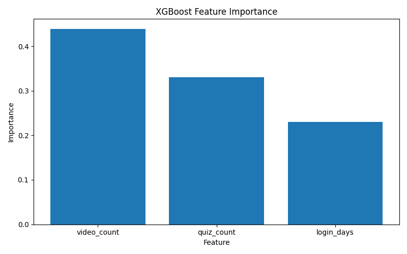

#  Online Course Completion Prediction (XGBoost)

##  Project Overview

This project simulates student learning behavior and builds a machine learning model to predict whether a student will complete an online course.

The goal is to help EdTech platforms identify at-risk students early and provide timely intervention.

---

##  Features

* video_count: number of videos watched
* quiz_count: number of quizzes completed
* login_days: number of login days

---

##  Methodology

1. Generate synthetic dataset (300 students)
2. Train/Test split (80/20)
3. Train XGBoost classifier
4. Evaluate model performance
5. Analyze feature importance

---

##  Result

* Accuracy: **0.767**

---

##  Feature Importance



Top feature:

* **video_count** (most influential)

---

##  How to Run

```bash
pip install -r requirements.txt
python src/train_xgboost.py
```

---

##  Insights

* Higher engagement leads to higher completion probability
* Video watching behavior is the strongest predictor

---

## ?? Tech Stack

- Python
- Pandas / NumPy
- Scikit-learn
- XGBoost
- Matplotlib

---

##  Future Improvements

* Add more behavioral features (e.g., watch time, quiz scores)
* Compare with other models (Logistic Regression, Random Forest)
* Use real-world dataset
